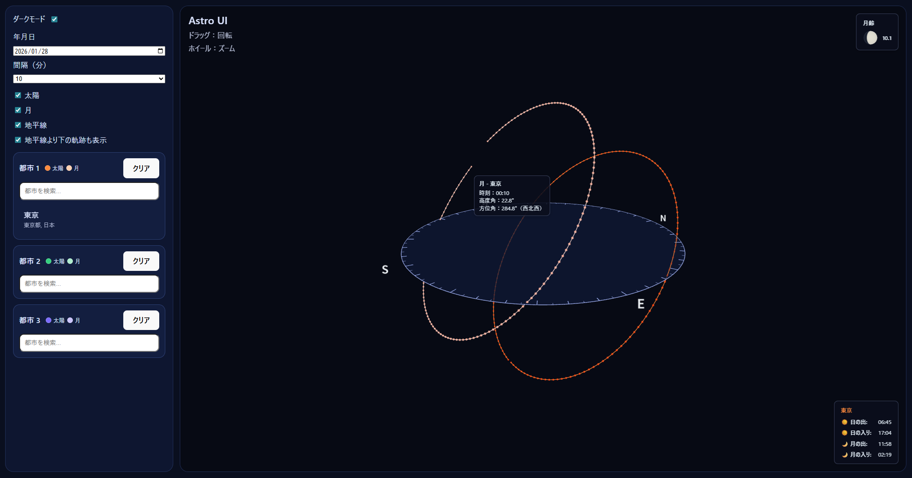
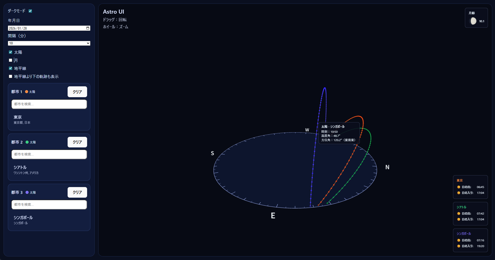
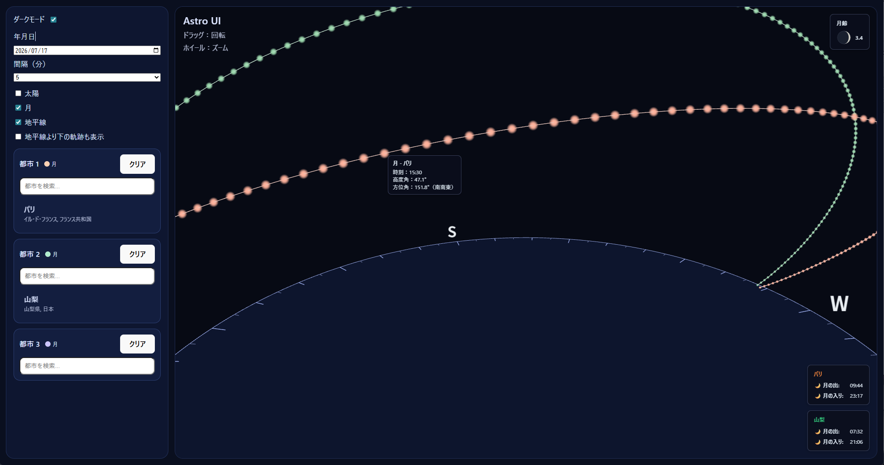

# Astro UI

太陽と月の軌跡を3Dで可視化するWebアプリケーションです。任意の都市と日付を選択して、その日の太陽と月の動きを視覚的に確認できます。





## 機能

- **3D可視化**: Three.jsを使用したインタラクティブな3Dビュー
- **複数都市対応**: 最大3つの都市を同時に表示・比較可能
- **太陽・月の軌跡**: 指定した日の太陽と月の1日の動きを表示
- **地平線表示**: 地平線の円盤と方位角の目盛りを表示
- **時刻情報**: マウスオーバーで各点の時刻、高度角、方位角を表示
- **日の出・日の入り**: 選択した都市の日の出・日の入り時刻を表示
- **月齢表示**: 選択した日の月齢を表示
- **ダーク/ライトモード**: テーマの切り替えが可能
- **タイムゾーン自動検出**: 都市の緯度・経度から自動的にタイムゾーンを検出

## 技術スタック

- **フロントエンド**: React 19 + TypeScript
- **ビルドツール**: Vite
- **3Dライブラリ**: Three.js
- **天文計算**: SunCalc
- **日時処理**: Luxon
- **タイムゾーン**: tz-lookup

## セットアップ

### 必要な環境

- Node.js 18以上
- npm または yarn

### インストール

```bash
# 依存関係のインストール
npm install

# 開発サーバーの起動
npm run dev
```

ブラウザで `http://localhost:5173` を開いてアプリケーションにアクセスできます。

## 使い方

1. **都市の選択**: サイドバーの検索ボックスで都市名を検索し、最大3つまで選択できます
2. **日付の選択**: 日付ピッカーで表示したい日付を選択します
3. **表示オプション**:
   - **Sun/Moon**: 太陽と月の軌跡の表示/非表示を切り替え
   - **Horizon**: 地平線の円盤の表示/非表示を切り替え
   - **Show below horizon**: 地平線より下の軌跡も表示するかどうか
4. **時刻ステップ**: 軌跡の点の間隔を5分、10分、15分から選択
5. **3D操作**: マウスでドラッグして視点を回転、ホイールでズーム

### ツールチップ

軌跡上の点にマウスオーバーすると、以下の情報が表示されます：
- 時刻（現地時間）
- 高度角（地平線からの角度）
- 方位角（北からの角度）

## 開発

### プロジェクト構造

```
src/
├── App.tsx              # メインアプリケーションコンポーネント
├── main.tsx             # エントリーポイント
├── lib/
│   ├── astro.ts         # 太陽・月の軌跡計算
│   └── geo.ts           # 都市検索機能
├── three/
│   ├── Scene3D.tsx      # 3Dシーンの管理
│   └── buildObjects.ts  # 3Dオブジェクトの構築
└── ui/
    └── Sidebar.tsx      # サイドバーUI
```

### ビルド

```bash
# プロダクションビルド
npm run build

# ビルド結果のプレビュー
npm run preview
```

### リント

```bash
npm run lint
```

## 主な機能の実装詳細

### 太陽・月の位置計算

`src/lib/astro.ts` で、SunCalcライブラリを使用して太陽と月の位置を計算しています。各都市のタイムゾーンを自動検出し、現地時間で正確な軌跡を生成します。

### 3D座標変換

`src/three/buildObjects.ts` の `toXYZ` 関数で、地平座標系（高度角・方位角）から3D座標（x, y, z）に変換しています。

### タイムゾーン処理

Luxonを使用して、UTCタイムスタンプを各都市の現地時間に正確に変換しています。これにより、ツールチップに表示される時刻が正確な現地時間になります。

## ライセンス

このプロジェクトはMITライセンスの下で公開されています。

## 貢献

バグ報告や機能要望は、GitHubのIssuesでお願いします。プルリクエストも歓迎します。

## 参考資料

- [SunCalc](https://github.com/mourner/suncalc) - 太陽・月の位置計算ライブラリ
- [Three.js](https://threejs.org/) - 3Dグラフィックスライブラリ
- [Luxon](https://moment.github.io/luxon/) - モダンな日時処理ライブラリ
